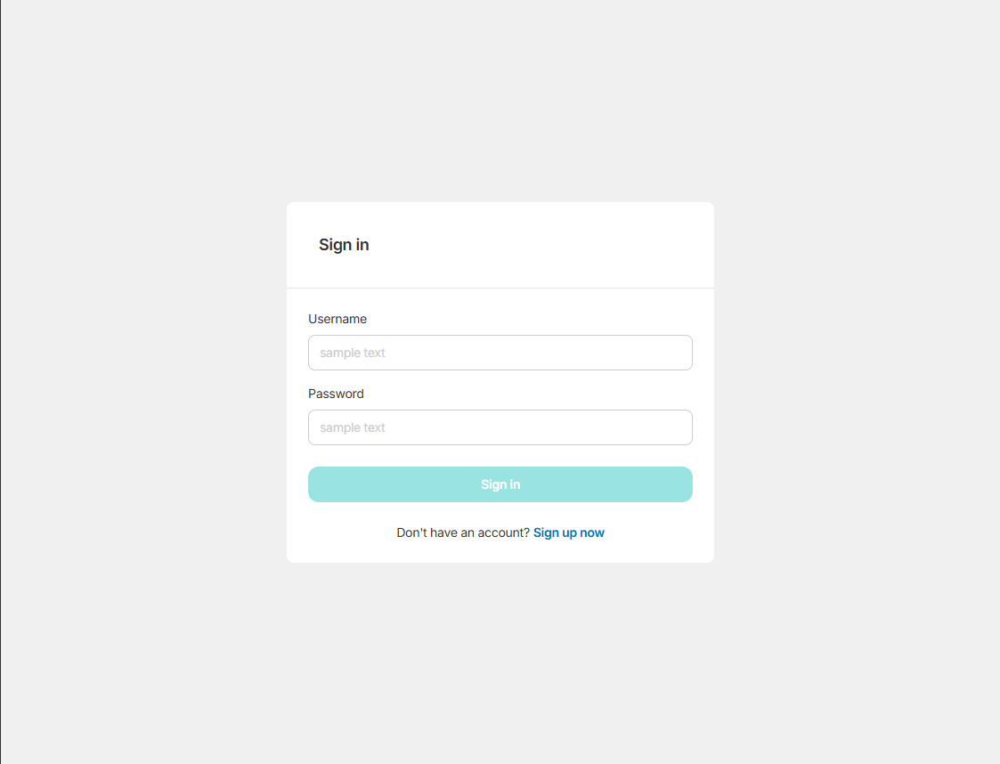
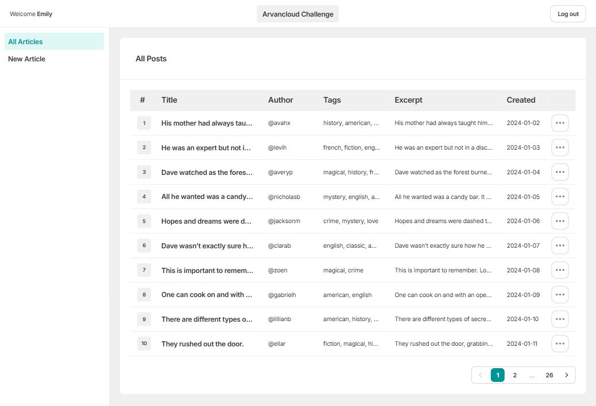
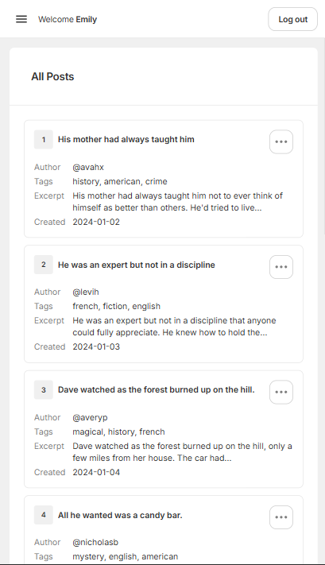
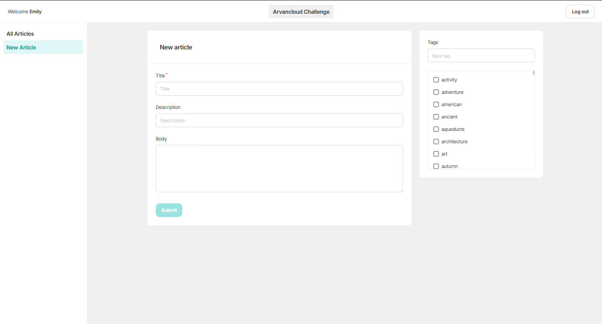
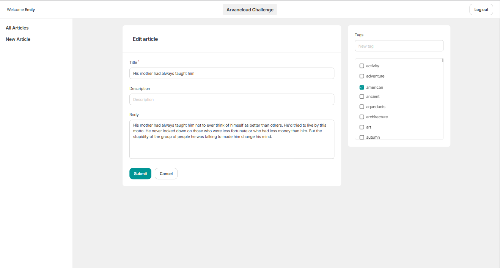
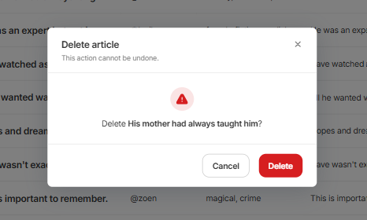

# Blog Admin Dashboard — Arvancloud Challenge

A dashboard to manage blog articles (list, create, edit, delete), built pixel-close
to a Figma design against the [DummyJSON](https://dummyjson.com) mock API.

**Live demo:** <https://blog-manager-nine.vercel.app> · **Sign in:** `emilys` / `emilyspass`

**Next.js 16** (App Router) · **React 19** · **TypeScript** (strict, no `any`) ·
**Tailwind CSS 4** · **TanStack Query** · **react-hook-form + Zod** ·
**Vitest + Testing Library + MSW** · **Storybook 9** · deployed on **Vercel**.

---

## Features

- **Auth** — login + register against DummyJSON, session held in **httpOnly cookies**
  set by Server Actions (tokens never reach client JS). Route guard redirects
  unauthenticated users to `/login`.
- **Article list** — server-rendered, server-side pagination
  (`/articles`, `/articles/page/:page`), responsive table → stacked cards on mobile,
  row `…` menu with Edit / Delete, focus-trapped delete confirmation, success toasts.
- **Create / edit** — `react-hook-form + Zod` forms (`Title` required), a Tags panel
  that **searches** the tag list and lets you **add** a new tag (checked by default),
  submit disabled + spinner while saving.
- **Optimistic CRUD over a non-persisting mock** — create / edit / delete update an
  in-memory **session overlay** so the table reflects changes instantly and stays
  consistent across `router.refresh()`, without a refetch resurrecting them
  (see [Architecture](#architecture)).
- **Design system** — tokens (colors / type / spacing / radius) as the single source
  of truth via Tailwind 4 `@theme`; every base component built with all states
  (default / hover / focus / disabled / **error**) and catalogued in Storybook.
- **Responsive & accessible** — desktop → tablet → mobile layouts, keyboard nav,
  focus rings, ARIA labels, `<th scope>`.

## Screenshots

| Login                                | Article list (desktop)                      | Mobile cards                                    |
| ------------------------------------ | ------------------------------------------- | ----------------------------------------------- |
|  |  |  |

| Create                                          | Edit + Tags                                 | Delete confirm                                   |
| ----------------------------------------------- | ------------------------------------------- | ------------------------------------------------ |
|  |  |  |

## Getting started

```bash
pnpm install
cp .env.example .env.local   # NEXT_PUBLIC_API_BASE_URL=https://dummyjson.com
pnpm dev                     # http://localhost:3000  → redirects to /login
```

Requires Node ≥ 20 (see `.nvmrc`) and pnpm.

## Scripts

```bash
pnpm dev            # dev server
pnpm build          # production build
pnpm typecheck      # tsc --noEmit (strict)
pnpm lint           # eslint
pnpm format:check   # prettier check (CI gate)
pnpm test:run       # vitest (run)
pnpm test:e2e       # playwright end-to-end
pnpm storybook      # component catalog on :6006
```

## Architecture

**Reads on the server, writes on the client.**

- **Reads (list) = React Server Components.** `getArticles(page)` fetches on the
  server; the URL is the source of truth for pagination — no client fetch, no
  loading flash. Author `@username` is resolved via `/users/{id}` and deduped with
  React `cache()`.
- **Writes (create / edit / delete) = TanStack Query mutations**, optimistic, layered
  onto the server rows through an in-memory **overlay** (`useArticleOverlay`).
  DummyJSON does not persist writes, so a plain refetch would resurrect a deleted
  row / drop a created one — the overlay keeps the UI both **in sync** (via
  `router.refresh()`) and **honest**. It lives in JS memory and clears on a hard
  reload. Full rationale in [`docs/API-MAPPING.md`](docs/API-MAPPING.md).
- **Auth = Server Actions + httpOnly cookies.** `/auth/login` tokens are read from
  the JSON body and re-set as our own httpOnly cookies server-side (XSS-safe);
  the route guard lives in `src/proxy.ts` (Next 16 renamed Middleware → Proxy).
- **Single network choke point** — every call goes through `lib/api-client.ts`
  with typed input/output and Zod-validated responses; components never `fetch`
  DummyJSON directly.

**Design ↔ API mismatches** (no `slug` / `created` / `description` / `excerpt` /
`author` on posts) are handled explicitly and documented in
[`docs/API-MAPPING.md`](docs/API-MAPPING.md). UI conventions and tokens are in
[`docs/DESIGN-SYSTEM.md`](docs/DESIGN-SYSTEM.md).

### Project structure

```
src/
  app/(dashboard)/articles/   # list, page/[page], create, edit/[slug]
  app/login · app/register
  components/ui/              # presentational design-kit components (+ stories/tests)
  components/layout/          # Shell, Sidebar, Header
  features/articles/          # api, components, hooks, getArticles, types (Zod)
  features/auth/              # api, actions (Server Actions), session, types
  lib/                        # api-client, utils (slugify/excerpt/cn), constants
  proxy.ts                   # route guard (Next 16 Proxy — sibling of app/)
```

## Testing

- **Unit / component (Vitest + Testing Library + MSW)** — pure utils
  (`slugify`, `excerpt`, pagination, `applyOverlay`), base components, and key
  flows (optimistic delete, form validation). DummyJSON is mocked with MSW.
- **E2E (Playwright)** — main flows: login, create, delete, pagination
  (`pnpm test:e2e`).
- **CI (GitHub Actions)** gates every push on typecheck, lint, format, and build.

## Simulated writes (important)

DummyJSON **does not persist writes**. Register, create, update, and delete all run
the real request and return a realistic response, but nothing is stored server-side.
The app uses optimistic UI + the session overlay so interactions feel real; state
resets on a hard reload. This is a constraint of the mock API, handled deliberately —
not a bug.

## Deploy (Vercel)

1. Import the GitHub repo on [vercel.com](https://vercel.com) (framework auto-detected).
2. Set env var **`NEXT_PUBLIC_API_BASE_URL=https://dummyjson.com`**.
3. Deploy — Vercel runs `pnpm build`. Add the resulting URL to the top of this README.
